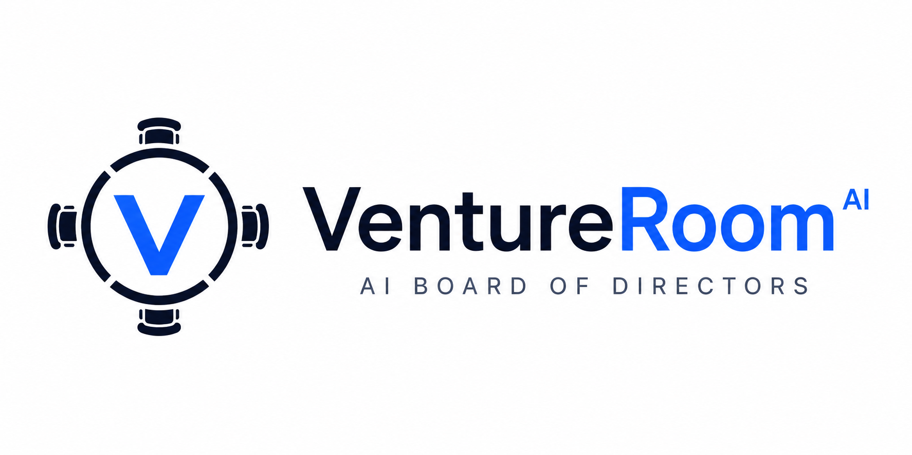
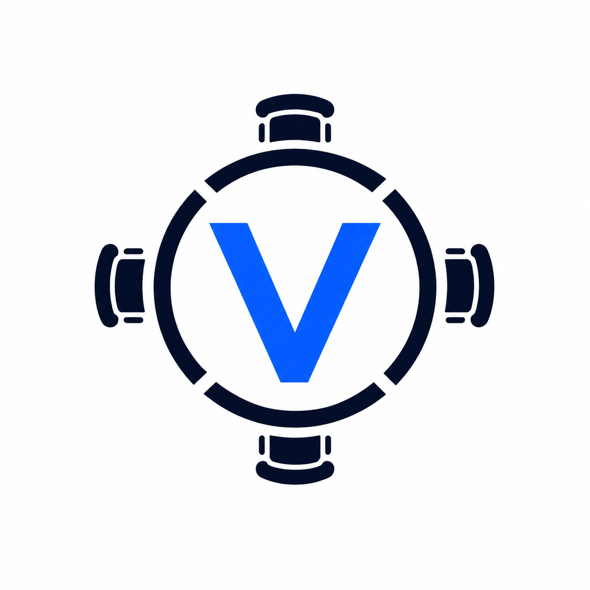
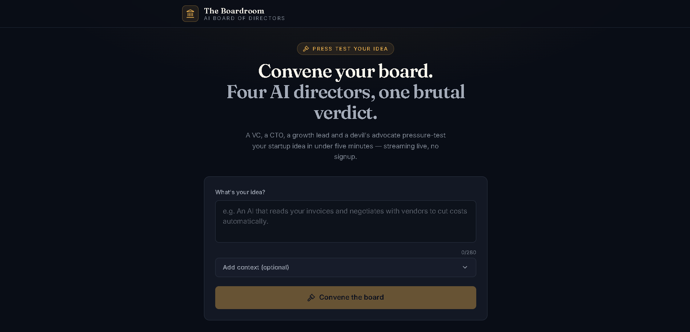
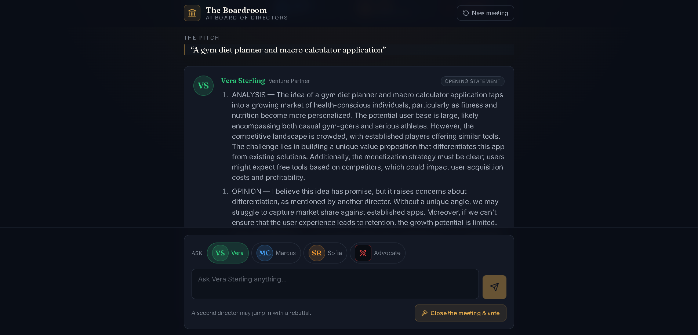
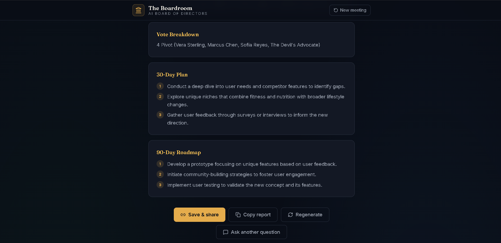
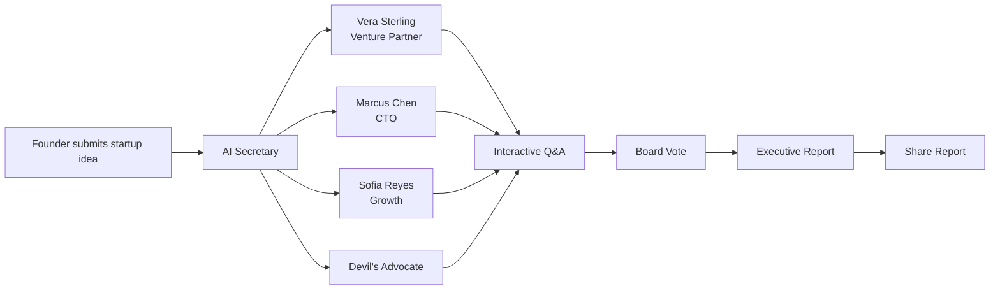
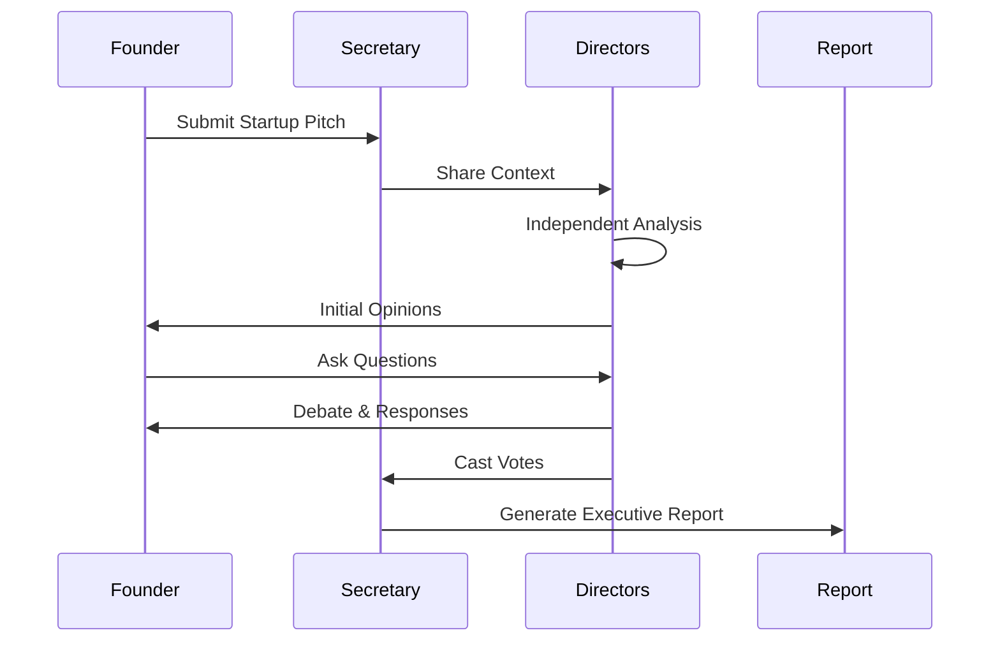
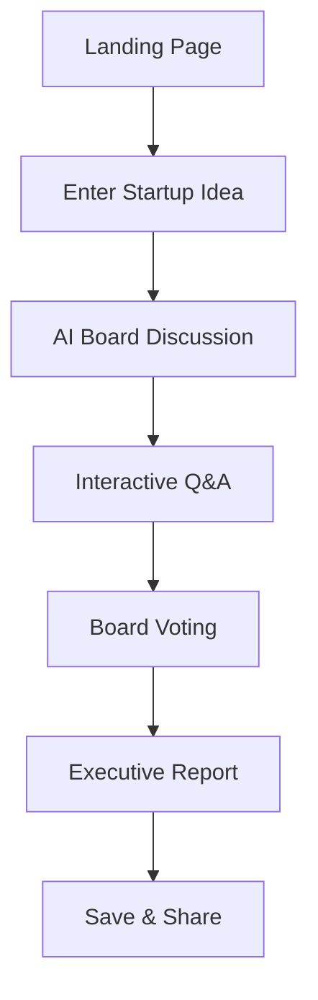

<p align="center">
  
</p>

<br>

<p align="center">
  
</p>

<h1 align="center">VentureRoom AI</h1>

<p align="center">
<b>Pressure-test startup ideas with an AI Executive Board.</b>
</p>

<p align="center">
Investor Insights • Technical Reviews • Growth Strategy • Contrarian Analysis
</p>

<br>

<p align="center">

<a href="https://ventureroom-ai.vercel.app">

</a>

<a href="https://github.com/Aaryan-2903/ventureroom-ai">

</a>


</p>

---

# 🚀 Live Demo

### 🌐 https://ventureroom-ai.vercel.app

Experience a realistic boardroom discussion where AI executives evaluate your startup just like real investors and leadership teams.

---

# ✨ Overview

**VentureRoom AI** is an AI-powered executive boardroom that helps founders validate startup ideas before investing months of time and money.

Instead of relying on a single AI response, VentureRoom simulates a realistic board meeting where multiple AI directors independently evaluate your startup, debate its strengths and weaknesses, challenge assumptions, and collectively produce an investor-grade strategic report.

Every meeting concludes with a structured executive report containing actionable insights, strategic recommendations, board voting results, and a roadmap for moving forward.

---

# ❓ Why VentureRoom AI?

Every founder asks:

- Is this startup worth building?
- Will investors actually like it?
- What are the hidden risks?
- Is my business model scalable?
- What would a CTO say?
- How would a Growth Lead approach this?

VentureRoom AI answers all of these questions in **one collaborative AI board meeting**.

---

# 🧠 Meet Your AI Board of Directors

| AI Director | Role | Focus |
|-------------|------|-------|
| 💼 **Vera Sterling** | Venture Capital Partner | Market size, fundraising, business model, competitive advantage |
| ⚙️ **Marcus Chen** | Chief Technology Officer | Architecture, scalability, engineering feasibility, AI reliability |
| 📈 **Sofia Reyes** | Head of Growth | Product positioning, GTM strategy, retention, pricing and growth |
| ⚖️ **Devil's Advocate** | Contrarian Advisor | Challenges assumptions, exposes risks, identifies failure points |

Each director has a distinct personality, expertise, and decision-making framework, creating dynamic discussions rather than generic chatbot responses.

---

# 🌟 Key Features

### 🏛 AI Executive Boardroom

Receive feedback from four specialized AI executives instead of a single AI assistant.

---

### 💬 Interactive Founder Q&A

Ask follow-up questions and continue the discussion naturally with the board.

---

### ⚖️ Independent Board Voting

Each AI director votes independently after evaluating your startup.

---

### 📊 Executive Strategy Report

Receive a professional board report including:

- Executive Summary
- Investment Recommendation
- Board Verdict
- Market Analysis
- Business Model Review
- Competitive Landscape
- Risks
- Strategic Recommendations
- 30-Day Action Plan
- 90-Day Growth Roadmap

---

### 🔗 Save & Share Meetings

Generate shareable meeting links so founders can easily send board discussions and reports to teammates, mentors, or investors.

---

### ⚡ Live Streaming Responses

Watch the board deliberate in real time with streaming AI responses that simulate a live executive meeting.

---

# 📸 Application Preview

## 🏠 Landing Page

<p align="center">

</p>

---

## 💬 Live Board Discussion

<p align="center">

</p>

---

## 📊 Executive Board Report

<p align="center">

</p>

---

# ⭐ Why It's Different

| Traditional AI Chat | VentureRoom AI |
|---------------------|----------------|
| One AI response | Four specialized AI executives |
| Single perspective | Multiple independent viewpoints |
| Generic advice | Investor-grade strategic analysis |
| No debate | Interactive executive discussion |
| No board voting | Independent board decisions |
| Simple chat | Professional executive report |
| Limited reasoning | Multi-agent collaborative thinking |
| No shareable reports | Save & Share meetings |

---

> *"Great startups aren't built by asking one person. They're built by surviving tough boardroom conversations."*
# 🏛️ System Architecture



---

# 🧠 AI Discussion Flow



---

# 🚀 Application Workflow



---

# 📁 Project Structure

```text
ventureroom-ai/
│
├── public/
│   ├── favicon.png
│   ├── logo.png
│   ├── banner.png
│   ├── landing-page.png
│   ├── discussion.png
│   └── report.png
│
├── src/
│   ├── components/
│   ├── lib/
│   ├── App.tsx
│   ├── main.tsx
│   └── index.css
│
├── supabase/
│   └── functions/
│
├── README.md
├── package.json
└── vite.config.ts
```

---

# ⚙️ Tech Stack

| Category | Technology |
|-----------|------------|
| Frontend | React + TypeScript |
| Build Tool | Vite |
| Styling | Tailwind CSS |
| Backend | Supabase Edge Functions |
| AI | OpenAI GPT |
| Deployment | Vercel |
| Version Control | GitHub |

---

# ⚡ Getting Started

### Clone Repository

```bash
git clone https://github.com/Aaryan-2903/ventureroom-ai.git
```

### Install

```bash
npm install
```

### Start Development Server

```bash
npm run dev
```

### Build

```bash
npm run build
```

### Preview

```bash
npm run preview
```

---

# 🌐 Live Demo

### 🔗 https://ventureroom-ai.vercel.app/

Experience the complete AI boardroom simulation directly in your browser.

---
   # 🎯 Roadmap

- [x] AI Boardroom Discussion
- [x] Interactive Executive Q&A
- [x] Independent Director Voting
- [x] Executive Summary Generator
- [x] Strategic Board Report
- [x] Shareable Meeting Reports
- [x] Responsive UI
- [x] Vercel Deployment
- [ ] PDF Report Export
- [ ] Slack Integration
- [ ] Custom AI Directors
- [ ] Team Collaboration
- [ ] Meeting History
- [ ] Voice Discussions
- [ ] Multi-language Support

---

# 🤝 Contributing

Contributions are always welcome.

If you'd like to improve VentureRoom AI:

1. Fork the repository
2. Create a feature branch

```bash
git checkout -b feature/amazing-feature
```

3. Commit your changes

```bash
git commit -m "Add amazing feature"
```

4. Push

```bash
git push origin feature/amazing-feature
```

5. Open a Pull Request

---

# 📈 Future Vision

VentureRoom AI is designed to become more than an AI chat.

The long-term vision includes:

- 🧠 Personalized AI Board Members
- 🌍 Market Intelligence
- 📊 Startup Scoring Engine
- 📈 Investor Readiness Score
- 💰 VC Matchmaking
- 📑 Pitch Deck Analysis
- 🎤 Voice Board Meetings
- 🤖 Custom Executive Personas
- 🏢 Team Workspaces
- 📄 One-click Investor Reports

---

# 💡 Inspiration

Founders rarely have access to experienced investors, CTOs, growth leaders, and strategic advisors before building.

VentureRoom AI democratizes that experience by simulating an executive boardroom where every idea is challenged before it reaches the real world.

---

# ⭐ Support

If you enjoyed this project:

⭐ Star this repository

🍴 Fork it

📢 Share it

Every star helps the project reach more builders.

---

<div align="center">

## 👨‍💻 Aryan R Mandal

**Full Stack Developer • AI Engineer • Hackathon Builder**

[](https://github.com/Aaryan-2903)
[](https://www.linkedin.com/in/aryan-mandal-94b66b278/)
[](https://ventureroom-ai.vercel.app/)
[](https://github.com/Aaryan-2903/ventureroom-ai)

</div>
---

# 📄 License

This project is licensed under the **MIT License**.

See the LICENSE file for details.

---

<div align="center">

# ⭐ VentureRoom AI

### AI Board of Directors

### Think Bigger. Debate Harder. Build Smarter.


### 🌐 Live Demo

https://ventureroom-ai.vercel.app/

---

Made with ❤️ using React, TypeScript, Supabase & OpenAI

</div>     I
    end
